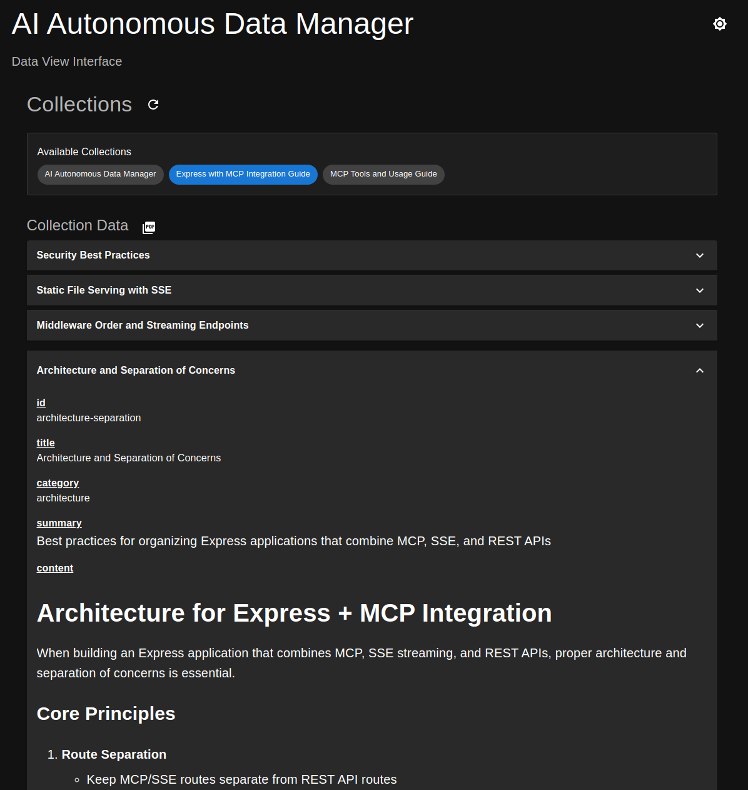

# AI Autonomous Data Manager MCP

## About

The AI Autonomous Data Manager is a specialized data management system designed to give AI agents (like those in Cursor, Cline, or other AI-enabled editors) autonomous control over dynamically structured data collections. It enables AI assistants to maintain persistent memory across conversations, organize information, and manage data without human intervention.

The server was created as an excercise to learn about MCP servers. How useful it is remains to be seen. It is provided as-is under the MIT license.

Key features:
- AI-driven collection creation with automatic schema validation
- Autonomous CRUD operations by AI agents
- Persistent data storage that survives across chat sessions
- Support for both STDIO and SSE (Server-Sent Events) modes

The system empowers AI agents to do things like:
- Build and maintain knowledge bases during conversations
- Track projects and tasks autonomously
- Organize learning content and generate quizzes
- Persist important information for future reference

### Viewing and Monitoring Collections

While the AI agents interact with collections programmatically, humans can monitor and inspect the data through:
1. Through the built-in web interface when running in SSE mode (http://localhost:3001)
1. Using the MCP Inspector tool (https://modelcontextprotocol.io/docs/tools/inspector)
1. Programmatically via the MCP server API endpoints

To export collections to PDF:
1. Access the web interface when running in SSE mode
1. Navigate to the desired collection and click the PDF icon

### Screenshot of the collections viewer




## Getting started

- Make sure you have Node and NPM installed
  - Development was done using Node version 22.14.0, but other versions will probably work

- Run `npm install` to install dependencies

### Run in STDIO mode

- Copy `run-example.sh` to `run.sh` and set the correct path (to the repository directory)

- Copy `.env-example` to `.env` and modify it if needed (should work as is)

- Start MongoDB using `docker-compose up` or use your own Mongo instance

   - If using your own instance, remember to change exported `MONGO_*` and `RUN_MODE` environment variables in the `run.sh` file accordingly

- Configure your editor/tool to use the MCP server

  Cursor editor example (`mpc.json`):

   ```json
    {
        "mcpServers": {
            "data_service": {
                // Same repository path as mentioned above
                "command": "/<path>/run.sh",
                "args": []
            }
        }
    }
    ```

### Run in SSE mode

**Note:** Running in SSE mode seems sketchy at times. While it works fine for the [MCP Inspector](https://modelcontextprotocol.io/docs/tools/inspector) tool. The server has sometimes crashed when Cursor or Cline was the client. So some improvements should be made to make SSE mode a bit sturdier.

- Start MongoDB using `docker-compose up` or use your own Mongo instance

   - If using your own instance, remember to change exported `MONGO_*` and `RUN_MODE` environment variables in the `.env` file accordingly


- Start the server: `npm start`

- Configure your editor/tool to use the MCP server

  Cursor editor example (`mpc.json`):

   ```json
    {
        "mcpServers": {
            "data_service": {
                "url": "http://localhost:3001/sse",
            }
        }
    }
    ```

### Start the app using scripts

#### NPM Scripts

- `start`
   - Starts the back-end directly from sourcecs using *TSX*.
   - Serves front-end from `dist/public/`
   - No hot-reloading is enabled
   - Front- and back-end are both available at port 3001

- `dev:back`
   - Starts the back-end on port 3001
   - Hot-reloading is enabled

- `dev:front`
  - Starts the front-end on port 5173 (default Vite port)
  - Hot-reloading is enabled

- `dev`
  - Runs `dev:back` and `dev:front` concurrently
  - Front- and back-end are served from ports 5173 and 3001 respectively
  - Hot-reloading is enabled for both

- `start:prod`
  - Run this script when providing the MCP server in **SSE** mode to an LLM
  - Builds the app
  - Runs the app from `dist/`, making available on port 3001
  - No hot-reloading (obviously)

#### Shell script

- `run.sh`
  - You are not supposed to run this shell script. Instead you will provide it for the LLM to run.
  - Sets environment variables (NPM scripts above uses `dotenv`)
  - Runs the app directly from `dist/` in **STDIO** mode
  - Note that it will not compile the app for you, so make sure to do that beforehand

## Available resources

- `data://server-description`

  Server Description: Description of the data service and its use cases.

- `data://collections`

  Metadata about available collections

## Available tools

**Note:** This section will not explain each tool in detail. Fot that please check
`src/back-end/mcp/tools/_tools-schema.yml` where you can see the descriptions provided for the LLM.

- add_collection_type

  Create a new collection type in the database

- add_batch_to_collection

  Add one or more entries to a collection

- get_from_collection

  Perform a query to retrieve entries from a collection

- delete_from_collection

  Delete a collection entry

- collection_summary

  Get a summary of a collection (returns all entries but only includes the `_id` and `summary` fields)

- get_resource_data

  Provides the same information as the `data://server-description` and `data://collections` resources.
  The reason for incuding it, is that not all MCP clients support resources.

##